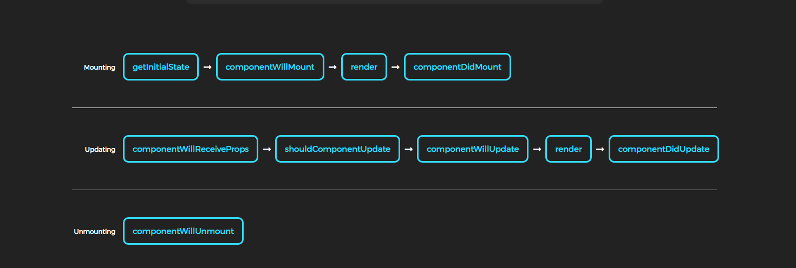
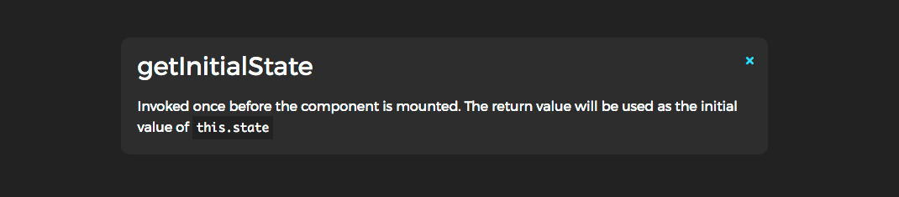
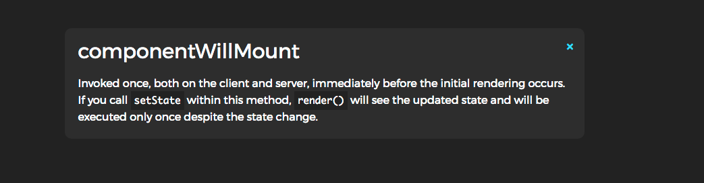
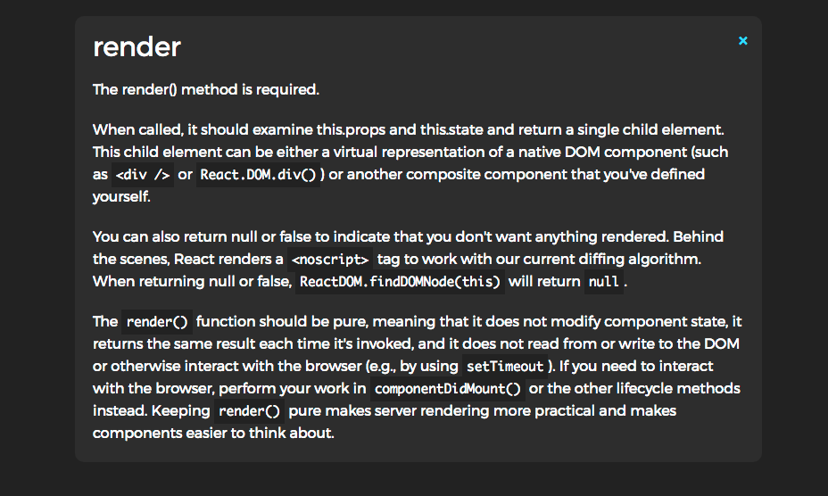
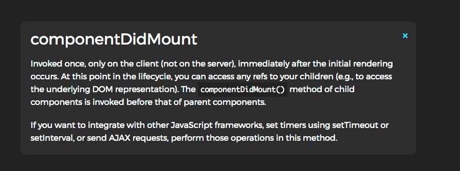
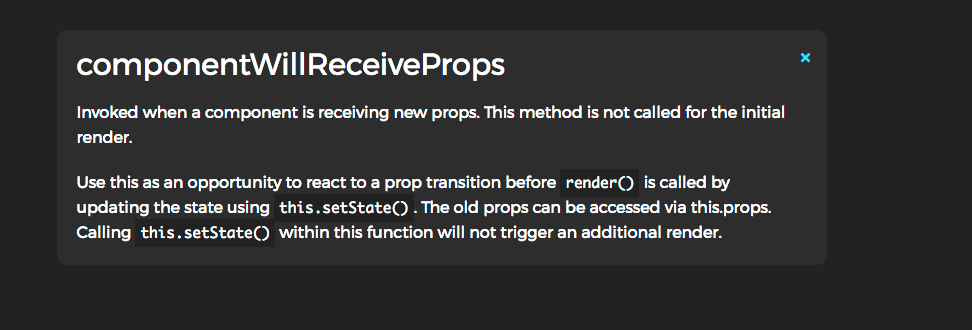
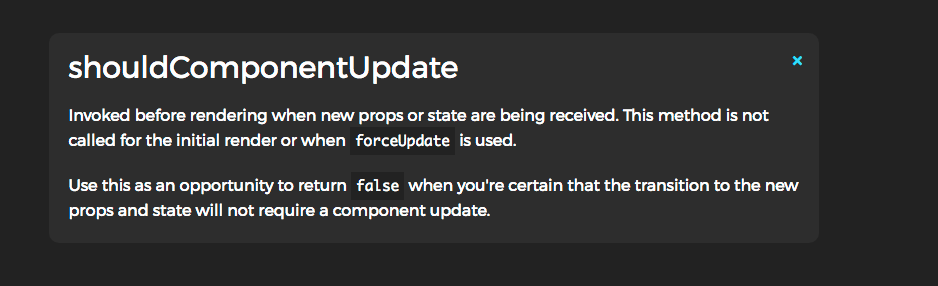
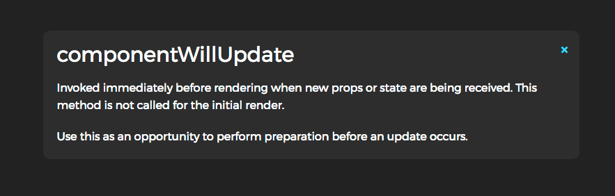
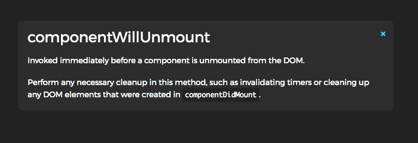

# React Native

> If you don't use ES6 yet, you may use the React.createClass helper instead. Take a look at Using React without ES6 to learn more.


## 生命周期函数

> Each component has several "lifecycle methods" that you can override to run code at particular times in the process. Methods prefixed with will are called right before something happens, and methods prefixed with did are called right after something happens. 

更多请阅读 [官方文档](https://facebook.github.io/react/docs/react-component.html)



来自[React components lifecycle diagram](https://codepen.io/eduardoboucas/details/jqWbdb)


### Mounting

>These methods are called when an instance of a component is being created and inserted into the DOM:









### Updating

>An update can be caused by changes to props or state. These methods are called when a component is being re-rendered:









### Unmounting

>This method is called when a component is being removed from the DOM:




### Other APIs

Each component also provides some other APIs:

* [setState()](https://facebook.github.io/react/docs/react-component.html#setstate)


### Class Properties

### Instance Properties#


## 调试

### Android 5.0及以上

使用adb reverse命令
注意，这个选项只能在5.0以上版本(API 21+)的安卓设备上使用。
首先把你的设备通过USB数据线连接到电脑上，并开启USB调试（关于如何开启USB调试，参见上面的章节）。

运行`adb reverse tcp:8081 tcp:8081`
不需要更多配置，你就可以使用Reload JS和其它的开发选项了。

### Android 5.0以下
通过Wi-Fi连接你的本地开发服务器
首先确保你的电脑和手机设备在同一个Wi-Fi环境下。
在设备上运行你的React Native应用。和打开其它App一样操作。
你应该会看到一个“红屏”错误提示。这是正常的，下面的步骤会解决这个报错。
摇晃设备，或者运行`adb shell input keyevent 82`，可以打开`开发者菜单`。
点击进入`Dev Settings`。
点击`Debug server host for device`。
输入你电脑的IP地址和端口号（譬如10.0.1.1:8081）。在Mac上，你可以在系统设置/网络里找查询你的IP地址。在Windows上，打开命令提示符并输入ipconfig来查询你的IP地址。在Linux上你可以在终端中输入ifconfig来查询你的IP地址。
回到开发者菜单然后选择Reload JS。


### getDefaultProps() 


`defaultProps` can be defined as a property on the component class itself, to set the default props for the class. This is used for undefined props, but not for null props. For example:

```javascript

class CustomButton extends React.Component {
  // ...
}

CustomButton.defaultProps = {
  color: 'blue'
};

```

If props.color is not provided, it will be set by default to `'blue'`:

```javascript

render() {
  return <CustomButton /> ; // props.color will be set to blue
}

```


If `props.color` is set to null, it will remain null:

```javascript

render() {
  return <CustomButton color={null} /> ; // props.color will remain null
}

```


Example

Native base 当中的 DefaultTabBar.js 

```javascript

const React = require('react');
const ReactNative = require('react-native');
import { connectStyle, StyleProvider } from '@shoutem/theme';
import variable from './../../theme/variables/platform';
import { TabHeading, Text, TabContainer } from './../../index';
import _ from 'lodash';

const {
  StyleSheet,
  View,
  Animated,
  Platform
} = ReactNative;
const Button = require('./Button');

const DefaultTabBar = React.createClass({
  propTypes: {
    goToPage: React.PropTypes.func,
    activeTab: React.PropTypes.number,
    tabs: React.PropTypes.array,
    backgroundColor: React.PropTypes.string,
    activeTextColor: React.PropTypes.string,
    inactiveTextColor: React.PropTypes.string,
    tabStyle: View.propTypes.style,
    renderTab: React.PropTypes.func,
    underlineStyle: View.propTypes.style,
  },
  contextTypes: {
    theme: React.PropTypes.object,
  },

  getDefaultProps() {
    return {
      activeTextColor: variable.topTabBarActiveTextColor,
      inactiveTextColor: variable.topTabBarTextColor,
      backgroundColor: null,
    };
  },

  renderTabOption(name, page) {
  },

  renderTab(name, page, isTabActive, onPressHandler, tabStyle, activeTabStyle, textStyle, activeTextStyle, tabHeaderStyle) {
    const headerContent = (typeof name!=='string') ? name.props.children : undefined;
    const { activeTextColor, inactiveTextColor } = this.props;
    const textColor = isTabActive ? activeTextColor : inactiveTextColor;
    const fontWeight = isTabActive ? 'bold' : 'normal';
    if (typeof name==='string') {
      return <Button
        style={{flex: 1, }}
        key={name}
        onPress={() => onPressHandler(page)}
        >
        <TabHeading style={(isTabActive) ? activeTabStyle : tabStyle} active={isTabActive}>
          <Text style={(isTabActive) ? activeTextStyle : textStyle}>
            {name}
          </Text>
        </TabHeading>
      </Button>;
    }
    else {
      return<Button
        style={{flex: 1, }}
        key={_.random(1.2, 5.2)}
        onPress={() => onPressHandler(page)}
        >
        <TabHeading style={tabHeaderStyle} active={isTabActive}>
          {headerContent}
        </TabHeading>
      </Button>
    }
  },

  render() {
    const variables = (this.context.theme) ? this.context.theme['@@shoutem.theme/themeStyle'].variables : variable;
    const platformStyle = variables.platformStyle;
    const containerWidth = this.props.containerWidth;
    const numberOfTabs = this.props.tabs.length;
    const tabUnderlineStyle = {
      position: 'absolute',
      width: containerWidth / numberOfTabs,
      height: 4,
      backgroundColor: variables.topTabBarActiveBorderColor,
      bottom: 0,
    };


    const left = this.props.scrollValue.interpolate({
      inputRange: [0, 1, ], outputRange: [0,  containerWidth / numberOfTabs, ],
    });
    return (
      <TabContainer>
        {this.props.tabs.map((name, page) => {
          const isTabActive = this.props.activeTab === page;
          const renderTab = this.props.renderTab || this.renderTab;
          return renderTab(name, page, isTabActive, this.props.goToPage, this.props.tabStyle[page], this.props.activeTabStyle[page], this.props.textStyle[page], this.props.activeTextStyle[page], this.props.tabHeaderStyle[page]);
        })}
        <Animated.View style={[tabUnderlineStyle, { left, }, this.props.underlineStyle, ]} />
      </TabContainer>
    );
  },
});

// module.exports = DefaultTabBar;
const StyledTab = connectStyle('NativeBase.DefaultTabBar', {}, mapPropsToStyleNames)(DefaultTabBar);
export {
  StyledTab as DefaultTabBar,
};


```


这个方法看起来很有意思

```javascript

  getDefaultProps() {
    return {
      activeTextColor: variable.topTabBarActiveTextColor,
      inactiveTextColor: variable.topTabBarTextColor,
      backgroundColor: null,
    };
  },

```


